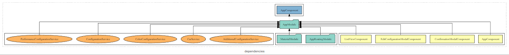

<!-- PROJECT LOGO -->
<br />
<a name="readme-top"></a>
<div align="center">
  

  <h3 align="center">Car Config Project</h3>

  <p align="center">
    A simple car configuration example app
  </p>
</div>

<!-- TABLE OF CONTENTS -->
<details>
  <summary>Table of Contents</summary>
  <ol>
    <li>
      <a href="#about-the-project">About The Project</a>
    </li>
    <li>
      <a href="#getting-started">Getting Started</a>
      <ul>
        <li><a href="#run-via-docker">Run via docker</a></li>
        <li><a href="#prerequisites">Prerequisites</a></li>
        <li><a href="#installation">Installation</a></li>
      </ul>
    </li>
    <li><a href="#shortcomings">Shortcomings</a></li>
  </ol>
</details>

### About The Project
This is a small example app with the goal of providing a UI where a user can configure a car and see the price of the configuration. To archive this I used the following stack: Angular + Angular Material as Frontend, Nest.js + TypeORM as Backend and Postgres as Database. Here you can see the architecture of the application:<br/>
<br/><br/><br/>
The frontend is very light with only a few components, one model and a service per entity:
<br/><br/><br/>
The backend has a controller per entity and offers a REST-API to the frontend:
<br/><br/><br/>
The database has 5 entity-types where all but one is related in a 1..n relationship to the configuration:
<br/>
<p align="right">(<a href="#readme-top">back to top</a>)</p>

### Getting Started

#### Run via docker
1. Install <a href="https://www.docker.com/">Docker</a> and <a href="https://docs.docker.com/compose/install/">docker-compose</a>
2. Clone the repository via: ```git clone https://github.com/DennisRauscher/CarConfig.git```
3. Execute in the root: ```docker-compose up```
4. You can now access the application via <a href="http://localhost:3000">http://localhost:3000</a>
4. (optional) To populate the database with some initial data run the ```seed.sql``` on the database


#### Prerequisites
- Node
- Angular CLI
- Nest CLI
- Local running instance of Postgres-DB

#### Installation
1. Clone the repository via: ```git clone https://github.com/DennisRauscher/CarConfig.git```
2. Run this in ```backend``` and ```frontend```: ```npm i```
2. Copy the ```backend/.env-example``` rename it to ```backend/.env``` and exit the variables as needed
3. To run the frontend build process run  ```npm run watch```
3. To run the backend build process run  ```npm run start:dev```
3. You can now access the application on <a href="http://localhost:3000">http://localhost:3000</a>


<p align="right">(<a href="#readme-top">back to top</a>)</p>

### Shortcomings
- Separate repos
- Execute Seed-SQL automatically
- Implement endpoints to manage options

<p align="right">(<a href="#readme-top">back to top</a>)</p>
